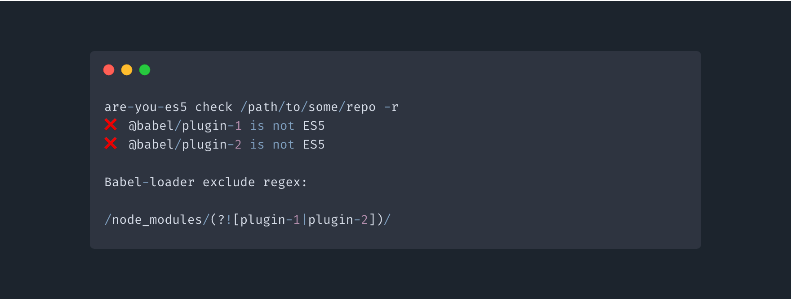

# are-you-es5
<!-- ALL-CONTRIBUTORS-BADGE:START - Do not remove or modify this section -->
[](#contributors-)
<!-- ALL-CONTRIBUTORS-BADGE:END -->

[](https://circleci.com/gh/obahareth/are-you-es5)
[](https://www.npmjs.com/package/are-you-es5)


A package to help you find out which of your `node_modules` aren't written in ES5 so you can add them to your Webpack/Rollup/Parcel transpilation steps. This is currently [limited to checking the entrypoint scripts only](https://github.com/obahareth/are-you-es5/issues/2), which **might** actually be enough of a check to determine if a package should be transpiled or not.



## Installing

You can install the package globally with

```bash
npm install -g are-you-es5
```

or if you'd rather just run it immediately you can use npx:

```bash
npx are-you-es5 check /path/to/some/repo
```

### Aliasing

If you've installed it globally and find it tiresome to type `are-you-es5` a lot, you can alias it to `es5`:

```bash
alias es5="are-you-es5"
```

# Upgrading from 1.1

If you were on version 1.1, the `-a` or `-all` option used to be for logging all messages, this has now changed to `-v` or `--verbose` and `-a` and `-all` are now used as a flag to check all node modules.

# Upgrading to 1.3

1.3 Now by default skips checking anything that has the word `babel` or `webpack`, or if a string ends with `loader`.
To restore previous behavior use the `--no-regex-filtering` option.

## Usage

```
Usage: are-you-es5 check [options] <path>

Checks if all node_modules (including monorepos) at <path> are ES5

Options:
  -a, --all             Check all node_modules instead of just direct dependencies
  -v, --verbose         Log all messages (including modules that are ES5)
  --no-regex-filtering  Stops all filtering on babel-loader exclude regex (does not hide anything)
  -r, --regex           Get babel-loader exclude regex to ignore all node_modules except non-ES5 ones, by default does not show any babel or webpack modules, use with --no-regex-filtering if you want to see everything
  --silent              Do not log messages in the console (except regex if --regex is used)
  -h, --help            output usage information
```

### Usage as a Library

If you would like to use this package as a NodeJS library instead of a CLI dependency, you may use this snippet:

```js
import {
  checkModules,
  buildIncludeRegexp,
  buildExcludeRegexp
} from 'are-you-es5'

const result = checkModules({
  path: '', // Automatically find up package.json from cwd
  checkAllNodeModules: true,
  ignoreBabelAndWebpackPackages: true
})

/** Returns the regexp including all es6 modules */
const es6IncludeRegExp = buildIncludeRegexp(result.es6Modules)

/** Returns the regexp excluding all es6 modules */
const es6ExcludeRegexp = buildExcludeRegexp(result.es6Modules)
```

### Example

```bash
are-you-es5 check /path/to/some/repo -r
❌ @babel/plugin-1 is not ES5
❌ @babel/plugin-2 is not ES5

Babel-loader exclude regex:

/node_modules/(?![plugin-1|plugin-2])/
```

## Credits

- [acorn](https://github.com/acornjs/acorn) - All the actual ES5 checking happens through acorn, this package wouldn't exist without it.
- [es-check](https://github.com/dollarshaveclub/es-check) - This whole package wouldn't have been possible if I hadn't come across es-check and learned from it.

## Contributors ✨

Thanks goes to these wonderful people ([emoji key](https://allcontributors.org/docs/en/emoji-key)):

<!-- ALL-CONTRIBUTORS-LIST:START - Do not remove or modify this section -->
<!-- prettier-ignore-start -->
<!-- markdownlint-disable -->
<table>
  <tr>
    <td align="center"><a href="https://github.com/depoulo"><br /><sub><b>Paolo Priotto</b></sub></a><br /><a href="https://github.com/obahareth/are-you-es5/commits?author=depoulo" title="Code">💻</a></td>
    <td align="center"><a href="https://github.com/tooppaaa"><br /><sub><b>Clément DUNGLER</b></sub></a><br /><a href="https://github.com/obahareth/are-you-es5/commits?author=tooppaaa" title="Code">💻</a></td>
  </tr>
</table>

<!-- markdownlint-enable -->
<!-- prettier-ignore-end -->
<!-- ALL-CONTRIBUTORS-LIST:END -->

This project follows the [all-contributors](https://github.com/all-contributors/all-contributors) specification. Contributions of any kind welcome!